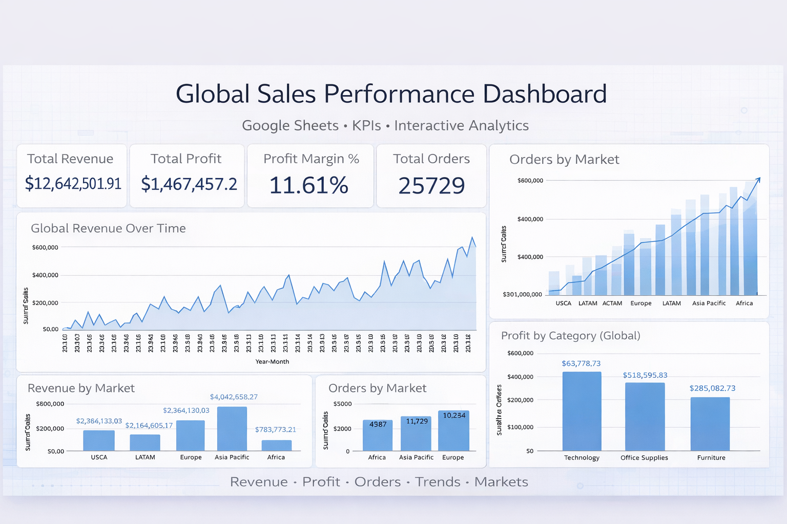

# Global Sales Performance Dashboard – Google Sheets  
**Author:** Ana C. Carrasco  
**Tools:** Google Sheets, Pivot Tables, Slicers, KPI Analysis, Data Visualization

---

## 📌 Overview

This project presents a **Global Sales Performance Dashboard** built in **Google Sheets** using the Global Superstore dataset. The dashboard provides a high-level view of worldwide sales activity, profitability, and order behavior across markets, time periods, and product categories.

The goal of this project is to demonstrate how a consistent analytics framework can be applied to a more complex, global dataset while maintaining clarity, accuracy, and interactivity.

---

## 🧠 Business Purpose

This dashboard is designed to:

- Provide leadership with a consolidated view of global revenue and profit performance.
- Enable comparison of performance across international markets.
- Reduce manual reporting by centralizing KPIs and trends into one interactive view.
- Support strategic decisions by highlighting where revenue, volume, and profit diverge.

---

## 🔍 Key Metrics & Visuals

The dashboard includes the following core elements:

### **KPIs**
- Total Revenue
- Total Profit
- Profit Margin (%)
- Total Orders
- Average Order Value (AOV)

### **Trend Analysis**
- **Global Revenue Over Time** (monthly), used to identify growth patterns and seasonality.

### **Breakdowns**
- **Revenue by Market** to compare global market contribution.
- **Orders by Market** to contextualize revenue with order volume.
- **Profit by Category** to distinguish revenue-driving categories from profit-driving ones.

### **Filters & Interactions**
- Order Year
- Market
- Category  
All metrics and visuals update dynamically through slicers.

---

## 🛠️ Tools & Techniques Used

- Google Sheets
- Pivot Tables & Pivot Charts
- Slicers for interactivity
- Array formulas for scalable calculations
- KPI-driven dashboard design
- Structured separation of data, logic, and presentation layers

---

## ⚙️ Workflow / How It Was Built

1. **Data Preparation**  
   Imported the Global Superstore dataset and created a dedicated cleaning layer with standardized dates, helper time fields (Year, Month, Year-Month), and calculated profit margin.

2. **Modeling**  
   Used pivot tables as the analytical engine to aggregate sales, profit, and order metrics in a filter-aware manner.

3. **Visualization**  
   Selected chart types aligned with business questions, including line charts for trends and bar charts for market and category comparisons.

4. **Interactivity**  
   Implemented slicers connected directly to pivot tables to ensure consistent filtering across KPIs and visuals.

5. **Design Choices**  
   Prioritized Market-level analysis for global storytelling, removed misleading grand totals from time-series charts, and protected data and logic layers to maintain integrity.

---

## 🚀 Impact / What This Dashboard Improves

- Enables fast comparison of global market performance.
- Clarifies the relationship between order volume, revenue, and profitability.
- Provides a repeatable reporting structure suitable for international operations.
- Improves confidence in decision-making through consistent, filter-aware KPIs.

---

## 📂 Files, Images, or Links

- **Interactive Dashboard:** [Google Sheets](https://docs.google.com/spreadsheets/d/1_0O9biarDdFp8Af3200OJ1Lm3UE3KRPl5lqxmflDKuU/edit?usp=sharing)  
- **Dataset:** Kaggle – [Global Superstore](https://www.kaggle.com/datasets/apoorvaappz/global-super-store-dataset)  
- **Documentation:** This README

---

## 🔮 Future Enhancements

- Add year-over-year growth metrics by market.
- Introduce profit margin comparisons across regions and categories.
- Integrate returns data to analyze revenue vs. returns impact.
- Automate data refresh for recurring reporting use cases.

---
